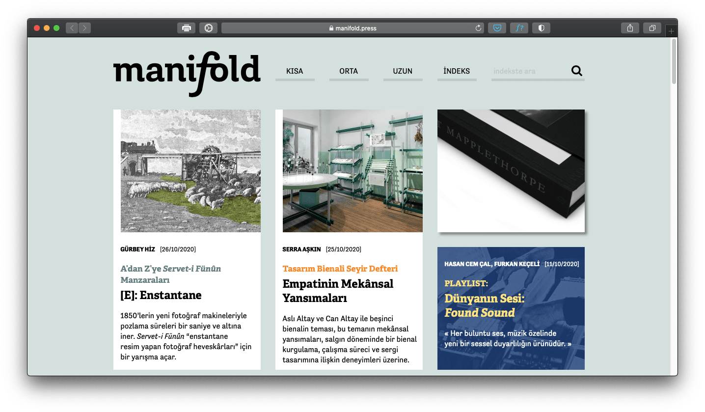
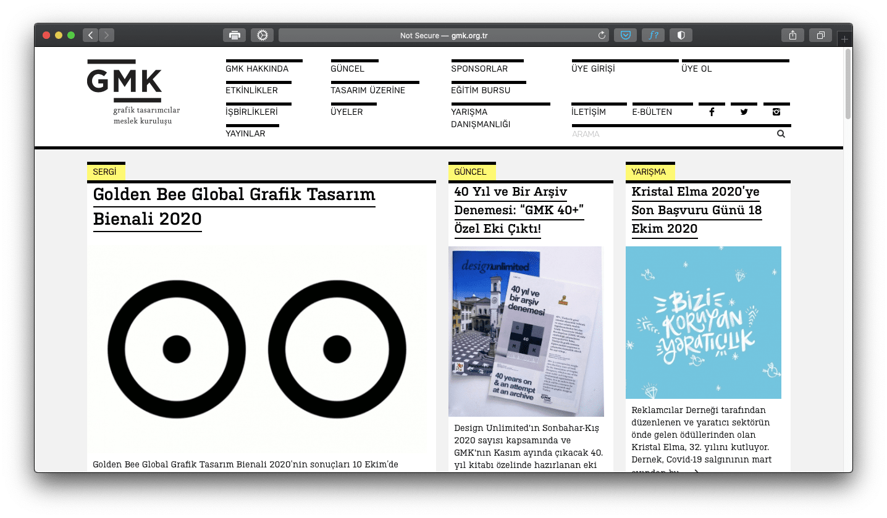
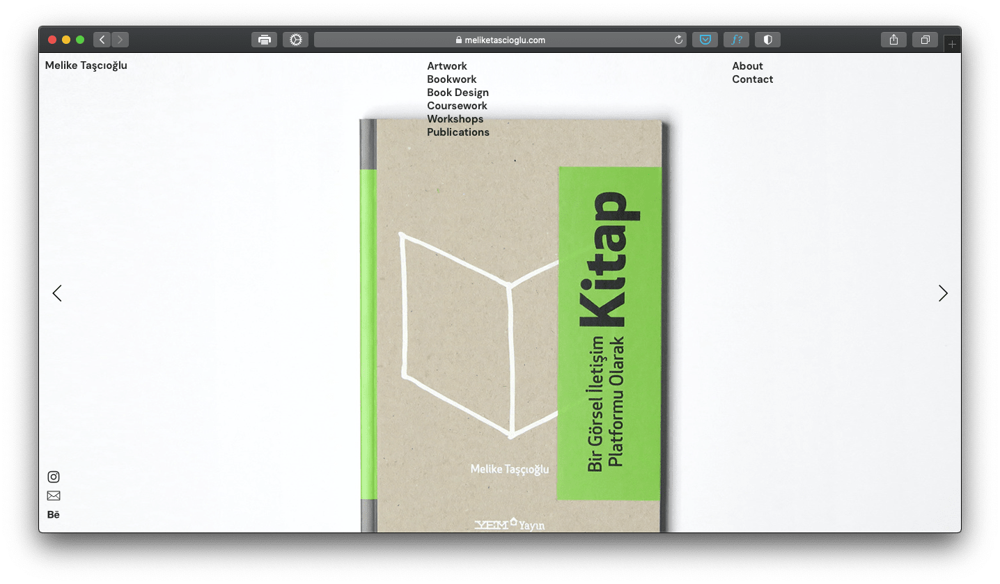
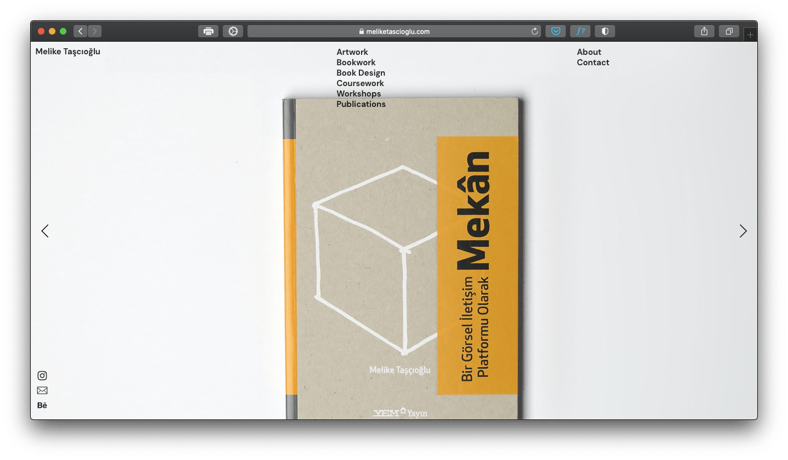
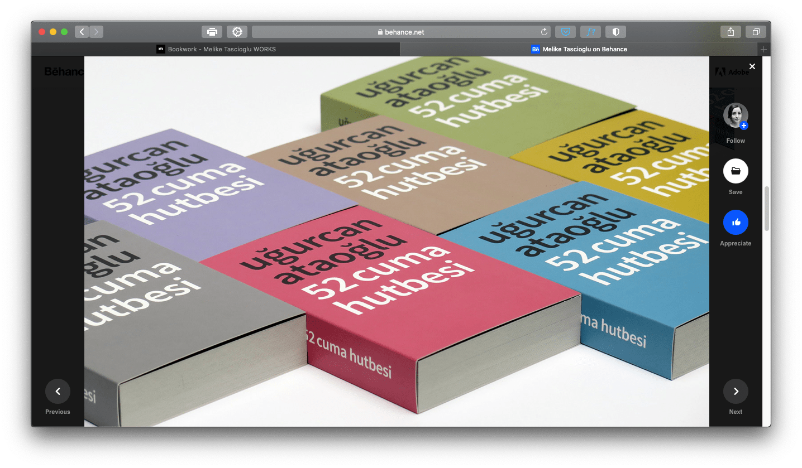
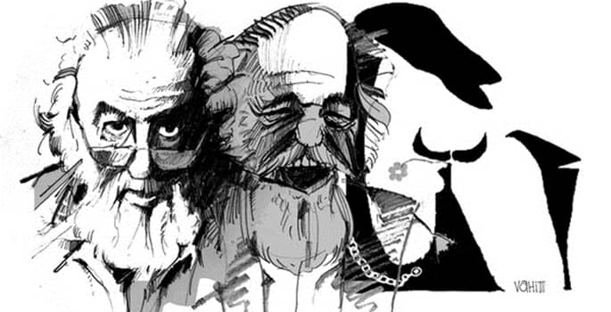
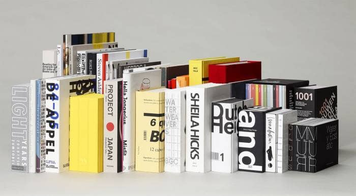
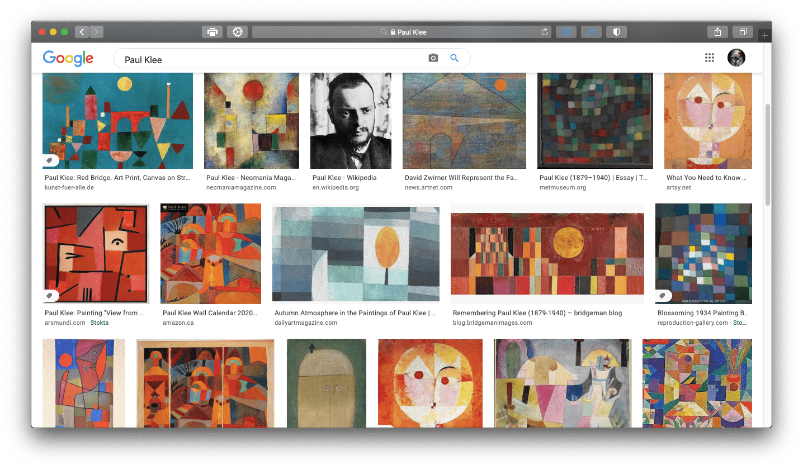
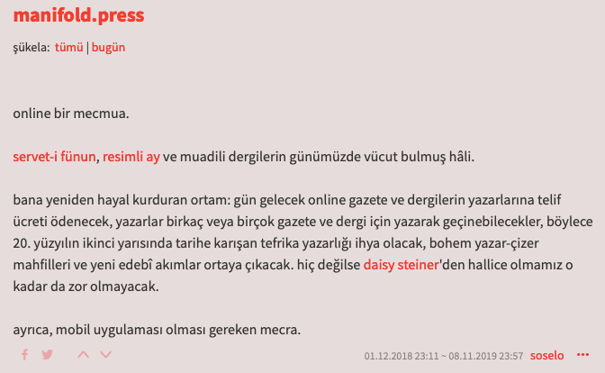
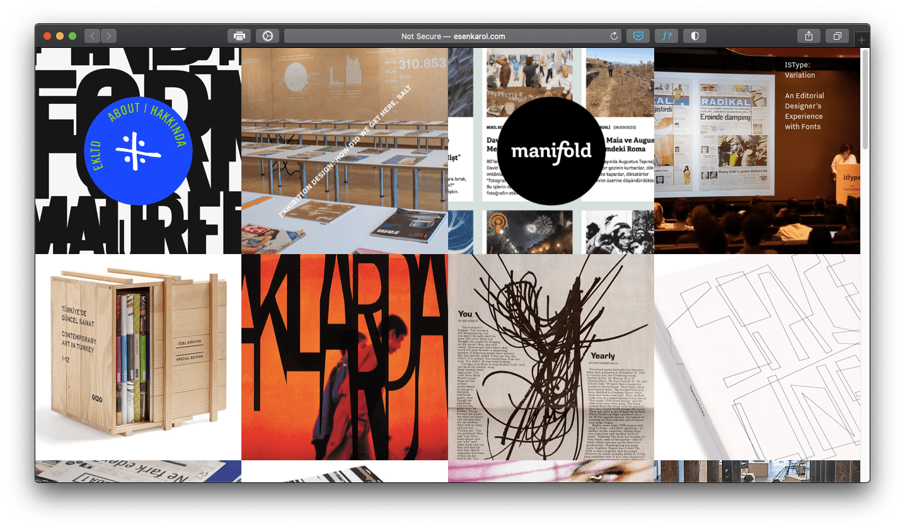

## Genel Notlar #1
Eserleri genel olarak incelediğimde, sadelik ve basitlik üzerine kurulu olduğunu gördüm çoğu eserin.

Özellikle yeni başlayan tasarımcılar, ay şuraya şunu koyayım, şuraya da şunu diyip karmaşa içinde boğulurken; bu alanda uzmanlaşmış isimlerin birkaç yazı tipi veya fırça darbesi ile birçok şeyi anlattığını görebiliyoruz. Tabii bazen afiş veya herhangi bir eserin tek bir şey anlatması gerekebiliyor. Belki de gerekmiyordur. Bu aklıma takılan noktalardan biri diyebilirim. 

Araştırmalarıma başlarken grafik tasarım adı altında kurulan siteleri incelediğimde, çok sadece ve basit tasarımlarla karşılaştım. Tıpkı bir gazete okurmuş gibi hissettim. Uzun bir süre içlerinde gezinip durdum. Tabi bu biraz Manifold'a hayran kalmamdan dolayı da olabilir.

---

## Kısaca Yaratıcılar
Bu başlığı "Tanrı" ile değil de ingilizce çevirisi olan "Creator" ile bağdaştırırsanız sevinirim. Bu tür kelimelere takılmak yerine kendimizi sanatın akışına bırakmak daha iyi olacaktır. :)

Daha öncesinde çokça tasarımcı gördüm ve inceledim. Ama benim dikkatimi en çeken ve beni cezbedenler illustrator'lar yani çizerler oldu. Sade ve basit tasarımların yanı sıra soft renk paletleri ile yapılmış, özellikle o göz doyuran karakter çizimleri beni benden alıyor.

İlk araştırdığım isim _Melike Taşçıoğlu_ oldu. Sitesine girip uzun uzun dolaştım. Akademik olarak uzun bir liste ile karşılaştım ilk başta. Kitap ve Mekan adında da iki adet önemli eseri bulunmakta. Daha çok tipografinin hakim olduğu eserler görmeniz kaçınılmaz. Ve kullandığı fontlarla beraber bu fontların yerleşimi hoşuma gitti. Ferah ve yaratıcı. 

**Birkaç örnek:**

Bir sonraki isimlere geçecek olursak, ülkemizde bu işi yapan en tecrübeli sanatçılardan _Mengü Ertel_ ve _Yurdaer Altıntaş_ gibi isimler var sırada. Ülkemizde afiş tasarımı konusunda ilklerdenler. Tabii devlet tarafından da özel ödüllere layık görüldüler.

> Mengü Ertel, bir grafik sanatçısıdır. İstanbul Güzel Sanatlar Akademisi'ni bitiren Ertel, tiyatrolar için yaptığı dekorlarla, afişlerle tanındı. 1. İstanbul Festivali'nin afişini Mengü Ertel hazırlamıştı. Çok sayıda ödülü olan Ertel, 1998'de Devlet Sanatçısı unvanını aldı. (Vikipedi)

> Yurdaer Altıntaş, Özellikle tiyatro ve sinema başta olmak üzere sanat afişleri düzenlemiş uluslararası üne sahip Türk grafik tasarımcısıdır. (Vikipedi)

Grafik tasarım babalarını araştırırken de çokça isimle karşılaştım. Bunlardan bazıları, bilindik birçok Türk markasının kurumsal kimliğini tasarlayan İhap Hulusi Görey ve adını sıkça duyduğum Tevfik Fikret Uçar, Emrah Yücel Uğur Erbaş gibi isimlerdi.

İlerleyen dönemlerde sanırım yazılarımda çokça adları geçecek gibi görünüyor.

Biraz da yabancı isimlere bakalım isterseniz. Listemde olan isimlerden ilki _Irma Boom_'du. Kendini kitaplara adayan ve "Kitapların Kraliçesi" olarak tanınan bu sanatçımız, Hollanda asıllı grafik tasarımcısıdır. Ve söz konusu kitaplar olunca "Tipografi"nin gücü hemen hemen tüm eserlerde göze çarpıyor.

Yabancı bir diğer isim ise _Paul Klee_. Dikkatimi çok çeken bu sanatçı, yazımın başlarında söylediğim renk paletlerini kullanan isimlerden. Yaratıcı tarzı ve eserleri çok hoşuma gitti diyebilirim.

> Paul Klee, Alman kökenli İsviçreli ressam. İlk olarak oryantalizmi öğrenen Klee, kendisine özgü tarzı ile dışavurumculuk, kübizm, gerçeküstücülük gibi pek çok akımda etkili oldu. Sanatçı renk teorisi hakkında çok fazla tecrübe sahibiydi ve bu tecrübelerini yazdı. (Vikipedi)

Ve son olarak Türk bir sanatçıyla ünlü isimlere bu yazımda noktayı koyacağım.

Esen Karol, birazcık üstlerde görselini yerleştirmiş olduğum [Manifold.press](https://manifold.press) blogunun kurucusu ve tasarımcısı. Onlarca yazıyı sitede yayınlayan bir de ekibi varmış. 

> Esen Karol Mimar Sinan Üniversitesi Grafik Bölümü’nden mezun olduktan sonra yüksek lisans eğitimini New York Pratt Institute’da Fulbright bursuyla tamamladı. 2002’de ilk kişisel sergisi “48 × 68” Pratt Manhattan’da gerçekleşti. Aynı yıl Pratt Institute’da konuk öğretim görevlisi olarak çalıştı. 2003–2012 yılları arasında İstanbul Bilgi Üniversitesi VCD bölümünde tipografi ve yayın tasarımı dersleri verdi. İşleri “How”, “IdN” ve “Slanted” gibi dergilerde yayımlandı. Arter için tasarladığı iki kitap, Design Observer ve AIGA tarafından gerçekleştirilen “50 Books 50 Covers” yarışmalarında yılın en iyi tasarlanmış 50 kitabı arasına seçildi: “Taşlar Konuşuyor”, 2013 ve “Aynadan İçeri”, 2014. Halen 1996’da kurmuş olduğu tek kişilik tasarım atölyesi “Esen Karol Tasarım Ltd”de çalışmakta ve 14 Temmuz 2016’da yayın hayatına geçmiş olan online yayın projesi “Manifold”a ağırlık vermektedir.(instagram.com/teduarch)

---

## Kapatırken
Grafik tasarım macerama nihayet akademik olarak adım attığım bu dönemlerde, öğrendiklerimi paylaşmak bana bi' nevi haz veriyor. Şimdilik ders notlarım olarak başlayan bu yazılarım ileride benim için kaliteli birer arşiv içeriği olmalarıyla beraber, gelişimimi ve öğrendiğim bilgilerin eserlerimi ne kadar etkilediğini göz önüne sermiş olacağım.

Araştırmalarımdan edindiğim bilgileri bu şekilde bir yere toplamaya çalışıyorum. Umarım hoşunuza gider. Bir hatam olduysa affola. Görüş ve önerilere her zaman açığım.

Bir sonraki ders notumda görüşmek üzere.

_Sağlıcakla..._

Ömer Ayyıldız

