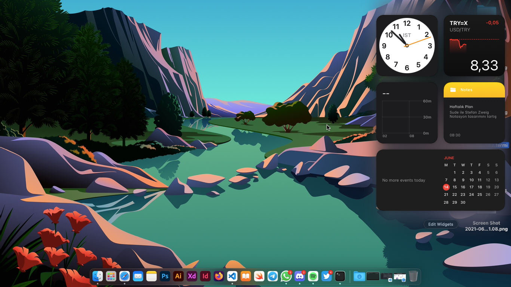
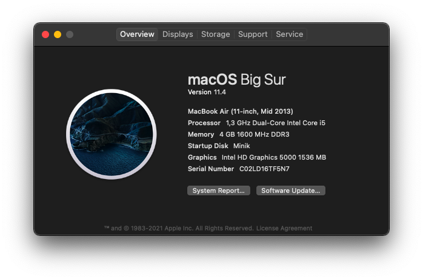
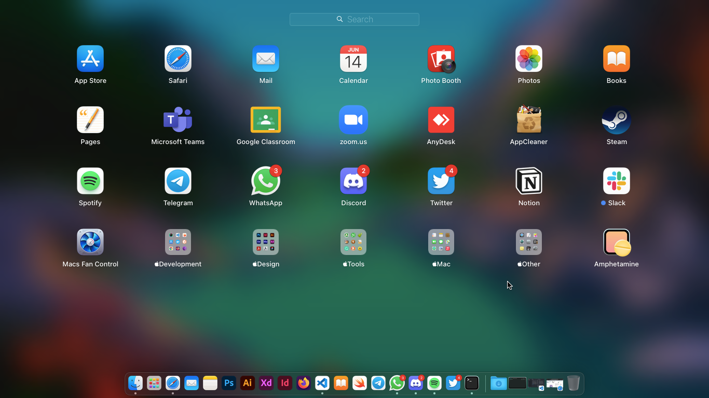
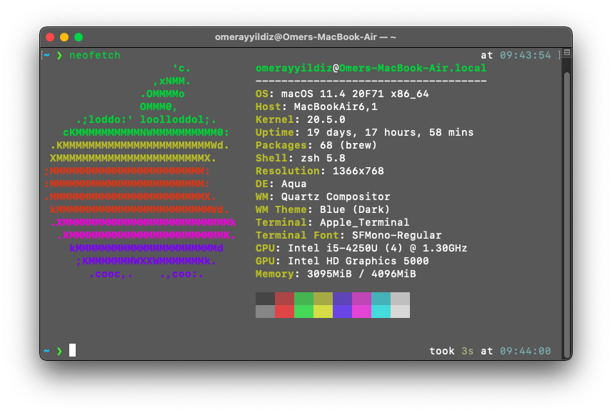
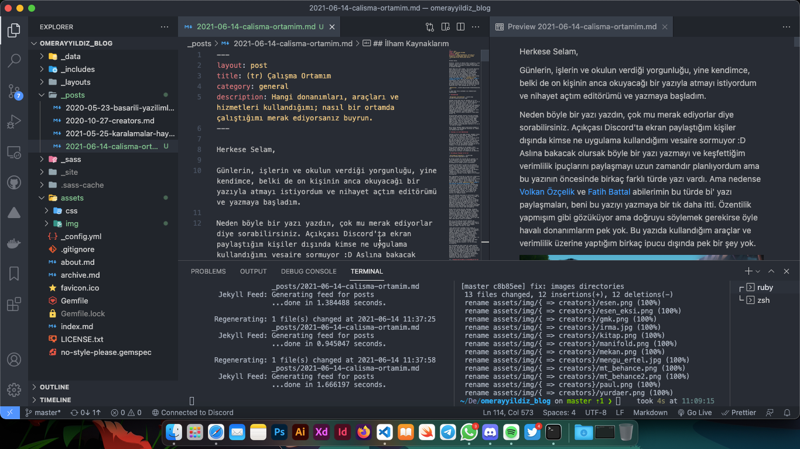
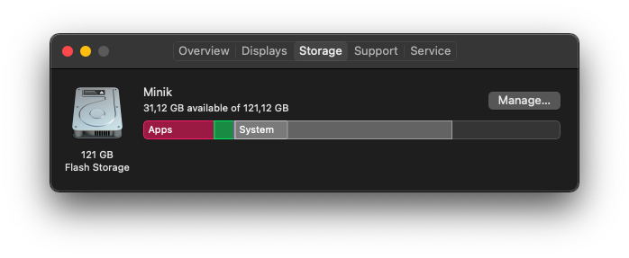
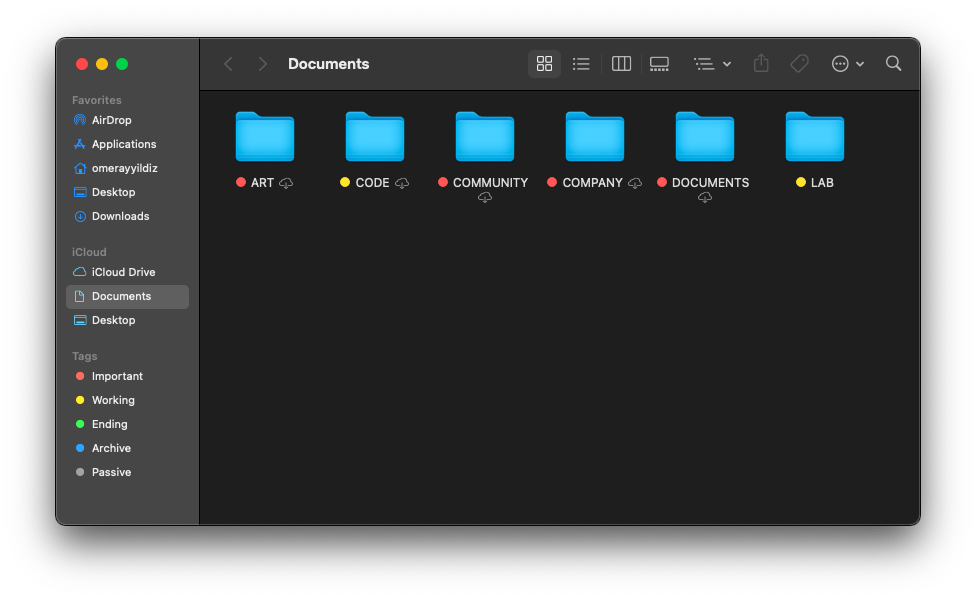

Herkese Selam,

Günlerin, işlerin ve okulun verdiği yorgunluğu, yine kendimce, belki de on kişinin anca okuyacağı bir yazıyla atmayı istiyordum ve nihayet açtım editörümü ve yazmaya başladım.

Neden böyle bir yazı yazdın, çok mu merak ediyorlar diye sorabilirsiniz. Açıkçası Discord'ta ekran paylaştığım kişiler dışında kimse ne uygulama kullandığımı vesaire sormuyor :D Aslına bakacak olursak böyle bir yazı yazmayı ve keşfettiğim verimlilik ipuçlarını paylaşmayı uzun zamandır planlıyordum ama bu yazının öncesinde birkaç farklı türde yazı vardı. Ama nedense [Volkan Özçelik](https://zerotohero.dev) ve [Fatih Battal](https://fatihbattal.com.tr) abilerimin bu türde bi' yazı paylaşmaları, beni bu yazıyı yazmaya bir tık daha itti. Özentilik yapmışım gibi gözüküyor ama doğruyu söylemek gerekirse öyle havalı donanımlarım pek yok. Bu yazıda kullandığım araçlar ve verimlilik üzerine yaptığım birkaç ipucu dışında pek bir şey yok.

O zaman daha fazla uzatmadan sizi bebeklerimle tanıştırayım. 

## Donanımlarım

Donanım olarak 2013 kasa bir Macbook Air'im var. İkinci bir monitörüm olsun çok isterdim ama şu an 11 inç'lik bu fıstık bana yetiyor. Elleri ayakları küçük olan bir eleman olarak, bu tür küçük cihazları, abilerine nazaran daha rahat kullanıyorum nedense. Şu anki makinemin tek canımı sıkan tarafı, 128 GB bir depolamaya sahip olması. SSD ve hızlı falan ama öyle keyfime göre büyük dosyaları ve uygulamaları bu minikte barındıramıyorum pek. İşim olmayan uygulamaları çoğunlukla kaldırmak zorundayım. Esaretin bedeli minimalist olmak desem yeridir :D.

Bilgisayarımın yanında tasarım işlerinde hayatımı kurtaran iki adet farem var. Biri kuzenimin vermiş olduğu kablolu, 360 derece tekerleği olan [Apple Mighty Mouse](https://macmarketi.com/4956/apple-mighty-mouse.jpg), diğeri ise [Microsoft Mobile 1850](https://www.amazon.com.tr/Microsoft-U7Z-00013-Wireless-Mobile-Mouse/dp/B00JUISCM6/ref=asc_df_B00JUISCM6/?tag=trshpngglede-21&linkCode=df0&hvadid=510344758068&hvpos=&hvnetw=g&hvrand=14844411669607289227&hvpone=&hvptwo=&hvqmt=&hvdev=c&hvdvcmdl=&hvlocint=&hvlocphy=1012782&hvtargid=pla-564656507704&psc=1) kablosuz fare. Apple'ın faresi yatay olduğundan mıdır bilinmez, bileğimi zamanında bir tık ağrıttı ama mini minnak elime cuk diye oturan Microsoft faremi pandemi ilk paşladığında almıştım ve şu an en çok sevdiğim faremdir.

Bütün bunlar dışında sadece bildirimlere bakmak ve arama yapmak için kullandığım telefonum var. Modeli ise [Samsung Grand Prime+](https://www.epey.com/akilli-telefonlar/samsung-galaxy-grand-prime-plus.html).

## Tasarım İçin Alet Edevatlarım

Tasarım öğrencisi olduğumdan dolayı, yanımda sürekli A5 boyutunda bir [eskiz defteri](https://www.hepsiburada.com/mona-lisa-eskiz-defteri-a5-50-yaprak-p-HBV00000DA3MC), renkli markerlar, rapidolar ve uçlu kalem var. Markerlarım **Artline**'ın [Brush Marker](https://www.hepsiburada.com/artline-supreme-brush-marker-siyah-p-HBV00000F0TBG)'ları. Uçlu kalem olarak bir tık ağır bir kalem olan [Scrikss Graph-X](https://www.hepsiburada.com/scrikss-versatil-graph-x-metal-0-7mm-kursun-gri-p-OFISNOTE077608) ve [Rotring](https://www.hepsiburada.com/rotring-tikky-okul-seti-0-7-mm-bordo-versatil-kalem-silgi-uc-p-HBV000006PFGZ) kullanıyorum. Çok iyi bir çizer değilim ama ödevlerim ve eskizlerim için muhteşem kalemlerdir. Öneririm. Okul gereği aldığım dağıtıcı ve türevi malzemelerim de var ama sıklıkla kullandığım araçlar olmadığı için yazma gereksinimi duymadım.

Bütün bunların yanında bir de yanımda sürekli taşıdığım ve arada okuduğum [Simon Garfield'in "Tam Benim Tipim"](https://www.hepsiburada.com/tam-benim-tipim-simon-garfield-p-KDOMINGO60414?magaza=Hepsiburada&wt_gl=cpc.6805.shop.nelk.kitap-ssc&isFashion=true&gclid=Cj0KCQjw5auGBhDEARIsAFyNm9Gk51fgcRcuzrohhkGhT6Pale5QFWcgMApiSoy1u9wZ826C8M5MG1MaAkQ8EALw_wcB) kitabı var. Çok güzel bir kitap, tasarıma yeni başlayan tüm arkadaşlara da öneririm.

## Kullandığım Yazılım ve Araçlar

Bu başlık altında hem tasarım hem de yazılım için tüm programları ve araçları yazmayı daha uygun gördüm. Öncellikle genel olarak tüm işlerimde kullandığım araçlarımı sizlere listeleyeyim.

Tarayıcı olarak [Safari](https://www.apple.com/tr/safari/)'yi baya bir kullanıyorum. Hafif, hızlı ve basit. Eklenti olarak Duck Duck Go Privacy Essential, What The Font ve [Grammerly Free](https://www.grammarly.com) kullanıyorum. Tanıdıklarımın böyle fantastik tarayıcı eklentileri olsa da bana bir tık gereksiz geliyor, o yüzden bu 3 eklenti dışına pek çıkamıyorum. Tabii Safari'nin yanında spesifik işlerim olursa Chrome, Firefox, Opera ve Tor Browser kullanıyorum.

Mail uygulaması olarak Mac'in kendi mail istemcisini kullanıyorum. Tüm e-postalarıma tek bir yerden erişebiliyor ve yönetebiliyorum. Mac'te hazır olarak gelen uygulamalardan en çok kullandıklarım ise Books, Calendar, Photos, Notes ve Apple TV. Notes'e daha yeni geçiş yaptım [Abdullah Uğraşkan](https://www.youtube.com/watch?v=fSLo4VeCZhk) abinin tavsiyesiyle. Daha öncesinde [Notion](https://www.notion.so) kullanıyordum fakat Notes daha basit ve hızlı geliyor. Şu anlık gayet memnunum. Apple TV'yi ise gerçekten aktif kullanan bir ben varım herhalde :D. Çok sık film izlerim ama böyle arada bir, bir hizmete bağlı kalmaksızın izlemek istediğim için Apple TV'de filmimi kiralayıp izliyorum. Çok da güzel ve kaliteli bir deneyim sunuyor.

Çoğu işte döküman hazırlayan ve tasarlayan o hayat kurtarıcı havalı(!) çocuk ben olduğum için Pages ve Numbers'ı baya bi' kullanırım. Neden Office kullanmıyorsunuz diyebilirsiniz. Okulun vermiş olduğu aboneliğim de mevcut ama basitlik ve hızdan yana olduğum için bu iki uygulama yerine başka bir uygulama kullanmıyorum döküman hazırlamak için. Tabii deli gibi Markdown yazan biri olduğum için, Markdown yazacağım zamanlar, eğer hızlıca hazırlamam gerekiyorsa Vim; daha detaylı hazırlayıp önizlemek istiyorsam Visual Studio Code kullanıyorum.

Sosyal mecra olarak Discord, WhatsApp, Telegram, Twitter ve Slack kullanıyorum. Günümün %90'ı falan Discord'ta geçiyor. Gerek bulunduğum ve yönettiğim topluluklar, gerek takım arkadaşlarım ve sınıf arkadaşlarım vesaire hep burada. Eğer Discord'da beni açık görmüyorsanız büyük ihtimal uyuyorumdur :D. Bir de neden "Twitter for Mac" kullanıyorsun diyen çok oldu. Çünkü neden olmasın. Biraz tırt ama daha rahat geliyor Safari'ye girmekten.

Okul ve eğitim aldığım kurumlar dışında pek kullanmadığım Microsoft Teams, Google Classroom ve Zoom sıkça kullandığım uygulamalar arasında. Okulun kendi sistemine ödev yüklemek yerine Google Classroom cidden çok basit ve rahat.

Şimdi gelelim benim yanımdan eksik etmediğim spesifik araçlara. İşim gereği bazen müşterilerime uzaktan bağlanmam gerekiyor ve bunun için [Anydesk](https://anydesk.com/en)'i cidden çok sık kullanan biriyim. Uygulamaları kökünden kazımak için [AppCleaner](https://freemacsoft.net/appcleaner/), minik bilgisayarımı ferahlatmak için [Macs Fan Control](https://crystalidea.com/macs-fan-control), yine miniğin uyuyakalmaması için [Amphetamine](https://apps.apple.com/tr/app/amphetamine/id937984704?mt=12), haftalık sistem temizliği yapmak için [MacPaw CleanMyMac X](https://macpaw.com/cleanmymac), PDF'leri ayırmak ve birleştirmek için basit bir araç olan [PDFsam Basic](https://pdfsam.org/pdfsam-basic/), büyük ISO dosyaları ve videolar indirmem gerektiğinde [Neat Download Manager](http://www.neatdownloadmanager.com/index.php/en/) ve çok önemli olmayan ama şifrelenmesi gereken dosyalar için ise [Encrytpo](https://macpaw.com/encrypto) kullanıyorum.

Çok kullanmadığım fakat arada bir cidden gerekli olan araçlar ise [WeTransfer](https://apps.apple.com/tr/app/wetransfer-menu-bar-transfers/id1114922065?mt=12), [Zoho Mail Client](https://www.zoho.com/mail/) ve [GeForce Now](https://gameplus.com.tr). Eskiden GeForce Now'u çok kullanırdım ama her geçen gün daha çok sırada bekletildiğim için artık yüzüne dahi bakmıyorum. Onun yerine [Steam](https://steamcommunity.com/id/omerayyildiz/)'deki devasa oyun kütüphanemi kullanmak yetiyor. Son olarak, arada bi içime kurt düşüyor ve makineyi taratasım geliyor. Bu tür zamanlarda [Malwarebytes](https://www.malwarebytes.com) kullanıyorum. Yaw Mac'e antivirüs mü kurulur diyebilirsiniz ama ben kullanıyorum gerektiği zamanlarda. Kimse kusura bakmasın :D.

### **Yazılım Geliştirmek İçin Kullandığım Araçlar ve Yazılımlar**

Savaşa bile gitsem yanımdan ayırmayacağım Terminal'imden başlayayım o halde. Mac için birçok terminal uygulaması olsa da ben direkt Mac'te yüklü gelen terminali kullanıyorum. Tabii zamanla özelleştirmem gerektiği için, biraz ayar var, yok değil. Birkaç renk, font ve saydamlık/blur ayarı yapıyorum. Eğer merak edip denemek isterseniz terminal profilimi [GitHub gistimden](https://gist.github.com/omerayyildiz/00cc126d604a484ca56b708d2efa7cf9) bulabilirsiniz. Birkaç makyajdan sonra ilk kurduğum araç [Oh-My-Zsh](https://ohmyz.sh). Hız için gerçekten mükemmel bir araç. Oh-My-Zsh kurduktan sonra direkt [powerlevel10k](https://github.com/romkatv/powerlevel10k) indirip kendimce konfigüre ediyorum. Temeli kurduk mu kurduuk. Geldik kullandığım terminal eklentilerime. Genellikle Oh-My-Zsh ile beraber gelen mi desem, desteklediği mi desem bilemedim; bu eklentiler ise şunlar [git](https://github.com/ohmyzsh/ohmyzsh/blob/master/plugins/git/git.plugin.zsh), [transfer](https://github.com/ohmyzsh/ohmyzsh/tree/master/plugins/transfer), [zsh-autosuggestions](https://github.com/zsh-users/zsh-autosuggestions) ve [zsh-syntax-highlighting](https://github.com/zsh-users/zsh-syntax-highlighting). Git eklentisinin çok tatlı alias'ları olmasıyla beraber transfer de gerçekten çok beğendiğim araçlardan. WeTransfer yerine terminalden kafamı hiç kaldırmadan tek bir komut satırıyla linkimi alıp müşterime veya arkadaşlarıma gönderebiliyorum. Geri kalan eklentiler ise yine makyaj için. Olmasa da olur yani :D.

Vim'i de çok sıklıkla kullandığımı söylemiştim. Profesyonel bir Vim kullanıcısı olmadığım için [vimrc](https://github.com/amix/vimrc) dışında pek bir şey kurmuyor veya konfigüre etmiyorum.

Terminal'den sonra en çok kullandığım araç ise [Visual Studio Code](https://code.visualstudio.com). Burası adeta evim. O yüzden evimi özelleştirmeyi çok seviyorum :D. Tema olarak [One Monokai](https://marketplace.visualstudio.com/items?itemName=azemoh.one-monokai) kullanıyorum. Gözü yormayan, hoş bir renk cetveli var. İkon teması olarak [Material Icon Theme](https://marketplace.visualstudio.com/items?itemName=PKief.material-icon-theme) kullanıyorum. Font ise sanırım Mac'te hangisi varsayılan geliyorsa onu kullanıyorum.

VSCode eklentisi olarak Better Comments, Bookmarks, Bracket Pair Colorizer 2, Discord Presence, Docker, Draw.io Integration, GitHub, Live Server, Prettier, Rainbow CSV, Remote - Containers, Remote - SSH, SourceKit-LSP, Swift Language, VSCode Vercel ve Tabnine. VSCode Vercel son zamanlarda keşfettiğim belki de en iyi eklenti. Proje deploy olurken loglarını takip etmek benim için bir tık önem arz ediyor. Bu yüzden tek tıkla ikona basıp logları görüntülemek hoş oluyor.

VSCode'de anlatabileceğim pek bir şey yok aslında. Ek olarak markdown preview modülünü çok beğeniyorum :D.

VSCode dışında C kursum için [CLion](https://www.jetbrains.com/clion/) kullanıyorum. Yeni yeni Swift öğrenmeye başladım. Bu yüzden şimdilik XCode'ye ihtiyaç duymuyorum, [Swift Playground](https://apps.apple.com/tr/app/swift-playgrounds/id1496833156?mt=12) yeterli oluyor.

Takım içinde proje yönetmek ve not almak için [Obsidian](https://obsidian.md) kullanıyoruz. Obsidian'ın ücretsiz versiyonunu kullanıyoruz fakat [kendi yaptığım bir araç](https://github.com/omerayyildiz/beginnerGit) sayesinde cloud üzerinde birçok senkronizasyon zımbırtılarını hallediyoruz :D. Çok havalı değil mi?

Araç olarak yeni olan bir tek [Docker Desktop](https://www.docker.com) var o da zorunluluktan duruyor yani :D. Terminal yeterli oluyor şu anki eğitimim için.

Volkan abinin yazısında kullandığı birçok cloud servisten bahsetmişti ama ben bu mecrada yeni olduğum için öyle şu servis iyidir kötüdür diyemiyorum. Biricik [Droplet](https://www.digitalocean.com/products/droplets/)'lerim dışında başka yerde ne sunucum var ne hostingim :D. Azure veya AWS neden kullanmıyorsun diyebilirsiniz, ama bana bu safhada bir tık karmaşık geliyor. Digital Ocean, üzümlü kekim pahalı olsa da sunduğu deneyim benim için paha biçilemez.

Ve son olarak en ama en çok takıldığım yer ise [GitHub](https://github.com/omerayyildiz). GitHub'da büyüklü küçüklü birçok projemin yanı sıra notlarım, proje takibi için **project board**'larım ve birçok konfigürasyonum bulunuyor. Yazılım geliştirme sürecinde öğrendiğime en çok mutlu olduğum şey belki de GitHub'dır. GitLab'ı da kullanmayı isterdim ama burda kurulu düzenim olunca geçemiyorum ya da geçesim gelmiyor :D.

### **Tasarım Yapmak İçin Kullandığım Araçlar ve Yazılımlar**

Bunları tahmin etmek çok zor olmasa gerek :D. Ama yine de tek tek tanıtayım kendilerini. [Adobe Illustrator](https://www.adobe.com/tr/products/illustrator.html) belki de en çok kullandığım tasarım programı. Kimi insanlara karmaşık veya zor geliyor ama yapamayacağınız şey yok(?) bu canavarda. Şimdi Figma'cılar gülecek ama ne derseniz diyin, basım/yayın, arayüz ve illustrasyonlar için tek bir arayüzde her şeyi yapabilmek benim için ayrı bir tutku. Şakayı bir kenara bırakacak olursak, benim çalışma alanım biraz farklı olduğu için açıkçası Ai daha rahat oluyor benim için. Ai'nin yanında kardeşleri olmadan olur mu, tabii ki olmaz. Photoshop, Xd, InDesign, After Effects, Media Encoder ve Acrobat DC, Ai'ye eşlik eden kardeşleri. After Effects'i [Kadir Şahin](https://thekadirsahin.com) eğitim vermediği sürece hiç açmadım vallaha ne yalan söyleyeyim :D. Bu aralar dergi ve kitap tasarımına sardığım için [InDesign](https://www.adobe.com/tr/products/indesign.html)'ı daha çok açtım diyebilirim.

Adobe serisi dışında [Figma](https://www.figma.com) ve [Aseprite](https://www.aseprite.org) kullanıyorum. "Oyun yapacaz biz" diye giriştiğimiz için almıştım Aseprite'yi ama burda bir tık farklı dünya olduğunu gördüm. **Pixel art** olarak daha farklı şeyler yapmak için açıp bir şeyler karalayınca hoş oluyor.

Hızlıca algoritmamı anlatmam gerektiği zaman veya sunumlarımda ise [Excalidraw](https://excalidraw.com) kullanıyorum. Tarayıcı üzerinde çalışan bu araç, hayat kurtarıyor diyebilirim.

Son olarak [SF Symbols](https://developer.apple.com/sf-symbols/) ise IOS geliştiricilerinin yakından tanıdığı Apple'a ait bir ikon kütüphanesi. Kendi işlerimde ve ödevlerimde buradan ikon almak baya bir işimi kolaylaştırıyor.

## Kullandığım Hizmetler

Müziksiz yapamayan biriyim ve bunla beraber birçok platformu deneme fırsatım oldu. Ama hala daha 4 yıldır [Spotify Premium](https://www.spotify.com/tr/premium/) üyeliğim var. Ve Spotify bilgisayarı açtığım vakit ilk çalıştırdığım program diyebilirim.

Spotify'dan sonra en çok para bayıldığım hizmet iCloud. Yer yok kardeşim makinede ne yapayım. [Google Drive](https://one.google.com/about?hl=tr) da biraz karmaşık geliyor o yüzden Mac'te en rahat iCloud vallaha ne diyim :D. 50 GB'lık paketle başlayan serüvenim şu an 200 GB ile devam ediyor. Yarın bir gün 2 TB olan pakete geçtim dersem şaşırmayın.

Kadir'le danaya girermiş gibi ortaklaşa kullandığımız [Adobe Creative Cloud](https://www.adobe.com/tr/creativecloud.html) aboneliğim var. İyi ki aldım dediğim hizmetlerden. İş ve eğitim hayatımda bıkmadan usanmadan para verebileceğim bir hizmettir kendileri.

Olsa da olur olmasa da olur dediğim bir adet YouTube Premium üyeliğim var. Yani dediğim gibi iyi hoş da pek bir fark hissetmedim vallaha aldığımdan beri. Öğrenci indirimi ucuza geliyor diye aldım. Eksik olmasın diye :D.

Kendi şahsi mail entegrasyonum için kullandığım [Google Workspace](https://workspace.google.com/intl/tr/) aboneliğim var. Zoho ve Yandex ücretsiz diyebilirsiniz ama birinin zorunlu client'ini kurmak zorundayken, biri ise Apple Mail istemcisine eklenmiyor bir türlü. Eeeh yeter be yeter diyip aldığım ve özellikle **Cloud Support**'undan memnun kaldığım Google Workspace'i bir süre daha kullanacağım gibi görünüyor.

Bütün bunlara ek olarak arada bir aldığım [Apple Arcade](https://www.apple.com/tr/apple-arcade/) aboneliğim ve [GMK](http://gmk.org.tr) aylık aidatım var. Ama ikisi de şu an pasif durumdadır efenim.

## Temizlik

Neden böyle bir başlık açtım açıklayayım :D. Ben gerçekten bir tık düzen ve temizlik hastasıyım diyebilirim. Bu yüzden odamdan, klasörlerime, maillerimden kitaplarıma kadar her şey ama her şey düzenlidir. Yazılımsal düzen kişiden kişiye farklılık göstereceğinden oralara pek girmeyeceğim. Ama birkaç ipucu vermeden geçmeyeceğim.

Öncellikle bilgisayarımı ve telefonumu genellikle çok da güçlü olmayan bir cam silme suyuyla bir güzel temizliyorum :D. Ekranlarımı ise Philips'in [SVC1116](https://www.amazon.com.tr/Philips-SVC1116-SVC-1116-200-mikrofiber-antistatik/dp/B005613ZJQ/ref=asc_df_B005613ZJQ/?tag=trshpngglede-21&linkCode=df0&hvadid=510151451400&hvpos=&hvnetw=g&hvrand=10247873555785866731&hvpone=&hvptwo=&hvqmt=&hvdev=c&hvdvcmdl=&hvlocint=&hvlocphy=1012782&hvtargid=pla-420169739910&psc=1) kodlu ürünü ile temizliyorum. Mikrofiber bezle bir güzel sildiniz mi ekran cillop gibi oluyor. Onun dışında USB deliklerini (Evet eski makine olunca USB girişlerim var :D) kaş tarama fırçasıyla kimi zaman traş makinesi temizleme fırçasıyla temizliyorum. Eğer siz de benim gibiyseniz japon pazarlarında vesaire bu tür küçük zımbırtıları bulabilirsiniz.

## İlham Kaynaklarım

Yazının sonuna yaklaşırken aslında bütün bu yazdığım şeylerin aslında bir araç olduğunu ve yaptığım işleri doğrudan etkilemediklerini eklemek istiyorum. Neden böyle diyorum. Çünkü yaptığınız işin kalitesini, öncellikle sizin karakteriniz daha sonra bilginiz ve tecrübeniz etkiler. Bu yüzden müşterilerime ve takım arkadaşlarıma, sadece onlara da değil, tüm çevreme iyi bir insan olmak için çalıştığım için bu çabamla beraber birçok değerli insandan değerli bilgiler de ediniyorum. Haliyle de hangi aracı kullanırsam kullanayım, bir şekilde işimi icraa edebiliyorum. Hayata küçük bir monitörden bakıyorum fakat işime olan tutkum bu ekrandan daha büyük :D.

Yakın zamanda tekrardan kitap okumayı alışkanlık haline getirdim ve iyi ki de getirmişim diyorum çünkü bir işi yapmadan önce ne kadar okur ve araştırırsam genellikle işimin kalitesi daha da artıyor. Hani çok mu iyiler, tartışılır ama bir kitaptan etkilenip ona göre bir tasarım yaptığımda genellikle çevrem tarafından çok beğeni topluyor.

Platform olarak [Pinterest](https://www.pinterest.com/omerayyildiz101/)'ten kolay kolay çıkmıyorum :D. Gerçekten muazzam bir yer. Bir şeyi düşünüp aratmam yeterli oluyor.

Bu başlık için ayrıca bir yazı yazmayı da planlıyorum. Umarım yakın zamanda size onu da paylaşabilirim.

Sevgi ve huzur dolu zamanlar dilerim.

Ömer Ayyıldız